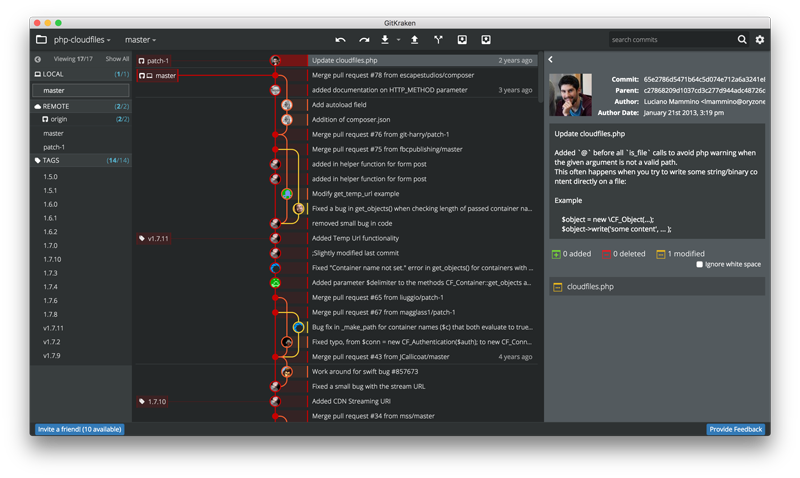
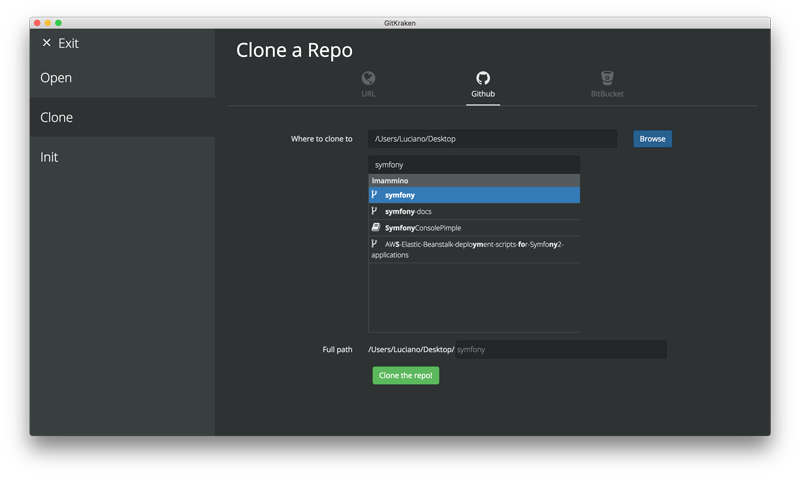

Axosoft is currently working on [GitKraken](http://www.gitkraken.com/) an innovative multi-platform graphical client for [git](/tag/git) which is already available for Windows, Linux and Mac OSX in **private beta** version.

The private beta is accessible through an invite code.
I was lucky to get an invite for me and **~~I have~~ some extra invites that I am willing to share with the first people who is going to leave a comment on this post**.

- UPDATE **2016-01-19 22:00 GMT**: I finished all the invites in less than 1 hour! That's incredible :O Sorry for whoever remained out, I'll let you know if I manage to get more invites!

- UPDATE **2016-01-19 23:00 GMT**: Seems that I was very very lucky and I got some **NEW INVITES**, keep commenting to get them! ;)

- UPDATE **2016-01-23 09:00 GMT**: Invites are over!

- UPDATE **2016-02-03 18:50 GMT**: Yesterday GitKraken 0.6 was released as Public Beta and it's free to be downloaded on the [official website](http://www.gitkraken.com/).

## What is GitKraken

As I said, GitKraken is a new *shiny* graphical interface for [git](/tag/git). I am a big fan of git from command line and even if I used a number of different GUIs in the past I always switched back to the console.
By the way, GitKraken looks promising thanks to a set of interesting features. Let's have a look at the ones that impressed me most after a first try.

### Network view

This is probably the **killer feature** at the moment, a *nice-looking* graphical view of your git network that allows you to understand what is the current status of you repository in terms of commits and branches. Every dot in the graph represents a commit and it is interactive. When you select one of them you can see all the changes applied by that commit, who pushed it, the commit description and, most importantly, if you right click on it you can immediately perform a number of actions which are notoriously not so trivial from the command line:

- cherry-pick
- create a branch from the specific commit
- create a new tag pointing that commit
- reset master to that commit
- edit commit message

### Integration with [GitHub](/tag/github)

GitKraken allows you to connect with your GitHub social account and easily access and clone from your remote repositories or fork an existing repository.

This is a lovely feature that will save you some amount of time if you are an active open source contributor or if your organisation is using GitHub for business.

The integration is currently limited to cloning, but I hope it will be improved to support also pull requests and issues (which would be definitely amazing!).

Also it's worth mentioning that the support for BitBucket seems to be coming soon!

### Branching and Stashing

There are a couple of other interesting operations that are made trivial by GitKraken...
I am talking about **branching** and **stashing**. By just clicking a button you will be able to create a new branch starting from the current head or from a specific commit and you can also *stash* your current *uncommitted* changes. When you stash something you will see a dot in your network graph that represents the stashed data as if it was a commit and you will be able to *unstash* that changes at any time later in the future.
Personally I believe these features can simplify the adoption of a Git branching model as [GitFlow](http://nvie.com/posts/a-successful-git-branching-model/) within your team.

### Built with [Electron](http://electron.atom.io/) and [Node.js](/tag/node-js)

While this is not a big differentiator at the moment (apart from making it immediately cross platform), I am quite sure that this feature will allow GitKraken to offer a nice extensibility layer offering people a way to write their own plugins/integrations.
Just look at recent softwares like [nylan/N1](https://github.com/nylas/N1) and [Atom](/3-invitations-to-try-atom-io/) to understand what is possible with this technology and why developers are loving these products.

## Conclusion

I think it's still to early to form a strong opinion about this product, but the premises are excellent and I would say we can expect great things for the first public release. I hope Axosoft will decide to keep it free as Atlassian is doing with SourceTree and that this choice might be another incentive to allow people to adopt or get even more familiar with Git.

I am curious to know your opinion about it and if you prefer to use a GUI rather than the command line, so please leave a comment.

Also remember to ~~leave a comment down below this post if you need an invitation to try it~~ (invites over)!

Until next time :)
