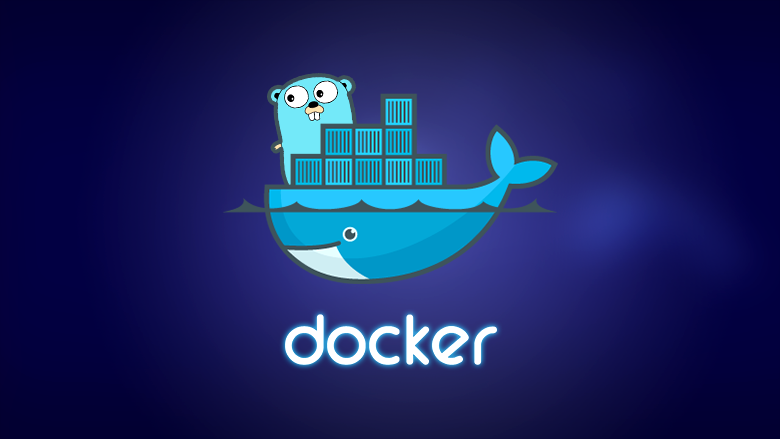
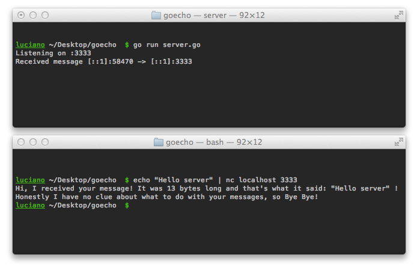

In this post we will see how to write a (very) simple **Go server app** and how to put it into a **Docker container** and run it.



**Disclaimer**: I'm an absolute beginner with both [Go](http://golang.org) and [Docker](https://docker.com) and this is just an experiment I did to start to explore this two interesting technologies. If you'll find something weird or wrong you are **very** encouraged to scream at me in the comments ([Comments](#disqus_thread)), I will be extremely thankful ;)

##Introduction

We are going to write a simple echo server in Go and then we will pack it into a Docker container for future execution/distribution.

*"Luciano, you are a PHP developer, why bothering with Go?"* 

Nice question! Well, there are at least two reasons for this choice:

- **Experimenting**! Yes Go seems to be the next cool thing in the field and I wanted to have an excuse to try it.
- **Simplicity**! Writing a server app in Go is just a matter of writing few lines of code in a file, so it's an very simple scenario to test the integration with Docker.

For those who are not familiar with these two technologies I suggest give the official websites a shot ([Docker.com](https://docker.com) and [Golang.org](http://golang.org)) as I will not provide many specific details about them.
I assume you have both technologies installed on your machine. If you are using Windows or a Mac have a look at [Boot2Docker](https://github.com/boot2docker/boot2docker), it will definitely make your life easier.

Beware that Go on your local machine is needed only if you want to test the application before "dockerizing" it. We will put the Go runtime into the Docker container in the second part of the post and this way we will be able to execute it without having Go installed in our local machine (that's infact the real advantage of using Docker).

##The Go echo server

Ok, first of all let's write and test our server app. The app should open a socket and listen for TCP requests on a given port. Then when it receives some data it should reply by saying something like that *"Hi, I received your message! It was X bytes long and that's what it said: XXX ! Honestly I have no clue about what to do with your messages, so Bye Bye!"*.

So let's just write some code. The following script has been widely inspired by [this one](https://coderwall.com/p/wohavg).

```go
//server.go

package main

import (
    "fmt"
    "net"
    "os"
    "strconv"
    "bytes"
)

const (
    CONN_HOST = ""
    CONN_PORT = "3333"
    CONN_TYPE = "tcp"
)

func main() {
    // Listen for incoming connections.
    l, err := net.Listen(CONN_TYPE, ":"+CONN_PORT)
    if err != nil {
        fmt.Println("Error listening:", err.Error())
        os.Exit(1)
    }
    // Close the listener when the application closes.
    defer l.Close()
    fmt.Println("Listening on " + CONN_HOST + ":" + CONN_PORT)
    for {
        // Listen for an incoming connection.
        conn, err := l.Accept()
        if err != nil {
            fmt.Println("Error accepting: ", err.Error())
            os.Exit(1)
        }

        //logs an incoming message
        fmt.Printf("Received message %s -> %s \n", conn.RemoteAddr(), conn.LocalAddr())

        // Handle connections in a new goroutine.
        go handleRequest(conn)
    }
}

// Handles incoming requests.
func handleRequest(conn net.Conn) {
  // Make a buffer to hold incoming data.
  buf := make([]byte, 1024)
  // Read the incoming connection into the buffer.
  reqLen, err := conn.Read(buf)
  if err != nil {
    fmt.Println("Error reading:", err.Error())
  }
  // Builds the message.
  message := "Hi, I received your message! It was "
  message += strconv.Itoa(reqLen) 
  message += " bytes long and that's what it said: \"" 
  n := bytes.Index(buf, []byte{0})
  message += string(buf[:n-1])
  message += "\" ! Honestly I have no clue about what to do with your messages, so Bye Bye!\n"
  
  // Write the message in the connection channel.
  conn.Write([]byte(message));
  // Close the connection when you're done with it.
  conn.Close()
}
```

Ok, the code is commented at it should be understandable enough. 
Let's try if it works.

Just launch the server with the command:

```bash
go run server.go
```

We will have our server running and it will print out something like:

```
Listening on :3333
```

Let's open another terminal window to try to speak with him. We will use [netcat](http://wikipedia.org/wiki/Netcat):

```bash 
echo "Hello server" | nc localhost 3333
```

That's what we should see in the two terminal windows:



The terminal window on the top is running our server and it logs all the received requests (by printing the incoming TCP address and the local one), while the second terminal is our client that sent out a simple "Hello server" message and received a *very useful* response from the server.

That's all from the Go side. In the next part of the post we will see how to "dockerize" this simple Go app. For now, you can obviously quit the server with a `CTRL+C`.


##Dockerizing the application

Ok, now we want to *"dockerize"* this simple application. Wait, what does *"dockerize"* mean? Well, by *"dockerizing"* an application we will be able to put the application itself and all its dependencies within a Docker container that can be easily shipped and executed elsewhere.


### Images, Containers and Dockerfile(s)

An extract from the Docker documentation should make things a bit clearer:

> Docker enables apps to be quickly assembled from components and eliminates the friction between development, QA, and production environments. As a result, IT can ship faster and run the same app, unchanged, on laptops, data center VMs, and any cloud.


There are several ways to dockerize an application and create a dedicated Docker container. The one I prefer at the moment is by adopting a "*Dockerfile*".

A "*Dockerfile*" is a file called exactly `Dockerfile` that contains several reproducible instructions to create a Docker *image* from scratch.

*What the hell is an image and how it is different from a container?*

If you are a noob with Docker (like me) you are probably asking yourself this question. I want to quote a [brilliant answer from stackoverflow](http://stackoverflow.com/a/21499102/495177) that should make things a bit clearer:

> An image is the set of layers that are built up and can be moved around. Images are read-only.
> 
> http://docs.docker.io/en/latest/terms/image/
> http://docs.docker.io/en/latest/terms/layer/
A container is an active (or inactive if exited) stateful instantiation of an image.
>
> http://docs.docker.io/en/latest/terms/container/

Feel free to visit these links if things are not clear yet.

Now let's get back to our `Dockerfile`. Every Dockerfile contains some metadata (base image from which to start, the name of the maintainer, etc.) and a set of instruction used to build the image. These instructions are usually used to "install" all the needed dependencies and describe how to execute the contained application.

### Let's write the Dockerfile

Enough talking, let's jump to the code:

```
FROM ubuntu:12.04

MAINTAINER Luciano Mammino

RUN apt-get install -y python-software-properties

RUN add-apt-repository ppa:duh/golang
RUN apt-get update
RUN apt-get install -y golang

ADD server.go /var/server/server.go

EXPOSE 3333

CMD ["go", "run", "/var/server/server.go"]
```

**Note:** A reader mentioned in a [comment](#comment-1881765009) that this dockerfile is no longer working (probably the PPA has beem removed or its temporary unavailable). If that's your case you can use a minimal dockerfile optimized for GoLang provided by in the [GoLang blog](https://blog.golang.org/docker#TOC_3.) itself.

Let's analyze all the instructions one by one:

- `FROM ubuntu:12.04` defines the base image from which to start. In this case we will use the `ubuntu:12.04` image, a very lightweight image based on ubuntu 12.04.

- `MAINTAINER Luciano Mammino` isn't it self-explanatory enough? ;)

- `RUN apt-get install -y python-software-properties` installs the `python-software-properties` package to be able to execute `add-apt-repository` next.

- `RUN add-apt-repository ppa:duh/golang`, `RUN apt-get update`, `RUN apt-get install -y golang` and  `RUN apt-get install -y golang`: adds a custom repository for Go and installs it.

- `ADD server.go /var/server/server.go`: copies the file `server.go` into the image (storing it into the `/var/server/` folder)

- `EXPOSE 3333`: exposes the port 3333 to allow containers launched from this image to listen on this port. We need exactly this port because it is the one used by our Go application.

- `CMD ["go", "run", "/var/server/server.go"]`: describes the command to execute our Go application when the container is launched (yes, it will execute `go run /var/server/server.go`).

### Let's build!

Before building the image from our Dockerfile, if you are using `boot2docker`, you need to run it with:

```bash
boot2docker start
```

In case it prints out something like this:

```
2014/06/29 16:09:32 Started.
2014/06/29 16:09:32 To connect the Docker client to the Docker daemon, please set:
2014/06/29 16:09:32     export DOCKER_HOST=tcp://192.168.59.103:2375
```

Run the suggested `export` command. Also take note of the given IP address as we would need to use later to connect to our server.

Now just `cd` into the folder that contains the `Dockerfile` and the `server.go` file and run:

```bash
docker build -t goecho .
```

Notice the `.` that refers to the current folder (yes you got it, it says Docker to look for a `Dockerfile` whitin it).

The `-t goecho` option is not mandatory and is used to "give a convenience name" to the resulting image.

You will see a series of commands being executed (yes the ones we wrote within our Dockerfile) and, if everything goes well, you should see something like this at the end:

```
Successfully built 713c09526bc1
```

You can also execute

```bash
docker images
```

To list all the available images (you should see our `goecho` on the top of the list).

Our image is ready to be run and trasformed into a live container. We'll see how to do it in the next part of the post.

### Running the container

Running the image and having a live container is just a matter of running:

```bash
docker run -i -t -p 3333:3333 goecho
```

The options `-i` and `-t` allows us to execute the container into the interactive mode that allows us to shut it down with `CTRL+C` when needed.

The option `-p 3333:3333` maps the container port 3333 to the same port on our machine. It will effectively allows us to talk with the echo server using the port 3333.

Now our container is live and running and our server application is active.

Let's open a new terminal window and try again:

```bash
echo "Hello server" | nc <ip> 3333
```

`<ip>` is `localhost` if you are not using `boot2docker`. If you are using it you need to provide the IP of the intermediade virtual machine provided by `boot2docker`. It is the one we recorded before, but if you can't find it you can simply run `boot2docker ip` to discover it (it's usually `192.168.59.103`).

## Conclusions

That's only the very beginning with Docker, there are a bunch of other interesting features and approaches. I will probably write some other post while I will keep learning and using Docker, so stay tuned and write all your suggestions in the comments.

Thank you
